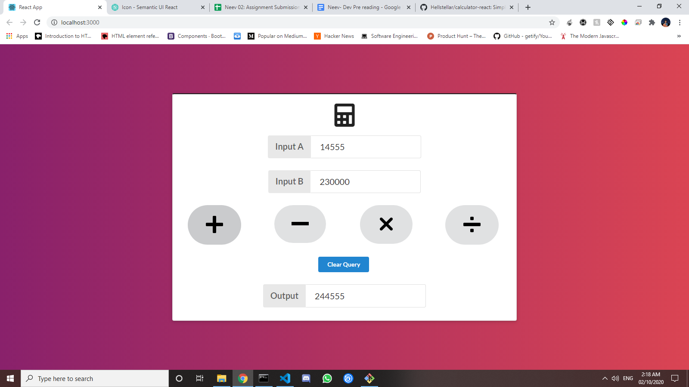

## Available Scripts

In the project directory, you can run:

### Operations

* Addition
* Subtraction
* Multiplication
* Division

### Validations

* Input fields are mandatory. (Without input values if someone click on any button then it should show error)
* Input field should allow only number

### Screenshots

