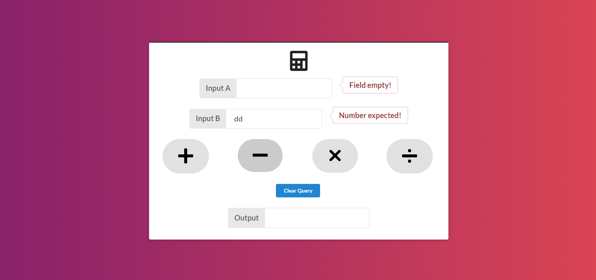
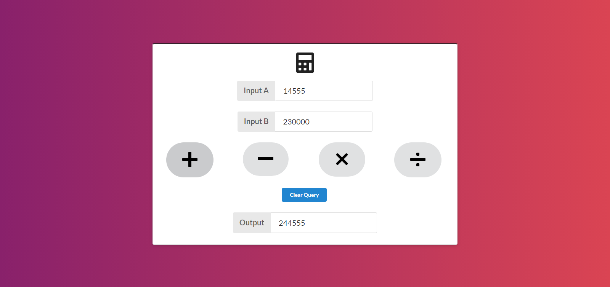

## Simple react calculator

React calculator made with semantic-ui-react

### Operations

* Addition
* Subtraction
* Multiplication
* Division

### Validations

* Input fields are mandatory. (Without input values if someone click on any button then it should show error)
* Input field should allow only number

### Screenshots

